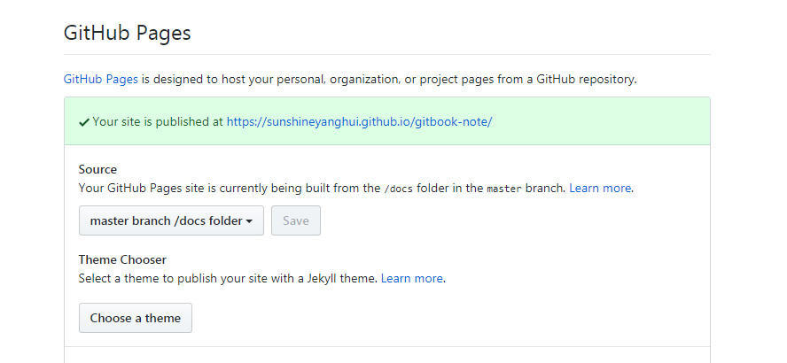

# git

## git 忽略不起作用

在Studio里使用Git管理代码的过程中，可以修改.gitignore文件中的标示的方法来忽略开发者想忽略掉的文件或目录，如果没有.gitignore文件，可以自己手工创建。在.gitignore文件中的每一行保存一个匹配的规则例如：


在填写忽略文件的过程中，我发现在Android Studio里面，.gitignore中已经标明忽略的文件目录下的文件，当我想git  push的时候还会出现在push的目录中，原因是因为在Studio的git忽略目录中，新建的文件在git中会有缓存，如果某些文件已经被纳入了版本管理中，就算是在.gitignore中已经声明了忽略路径也是不起作用的，这时候我们就应该先把本地缓存删除，然后再进行git的push，这样就不会出现忽略的文件了。git清除本地缓存命令如下：


```git
git rm -r --cached .
git add .
git commit -m 'update .gitignore'
```


## git 创建与推送 


```
cd gitbook-note
git init
git add -A
git commit -m"msg"
git remote add origin   https://github.com/sunshineyanghui/gitbook-note.git
git push -u origin master
```


`git` 这里有点特殊。要先加入到 staging area 的改动才会被 `git commit` 提交。同一个文件也可以 `add` 多次。不想`add`可以：

```
git commit -m 'msg' <file>
```

```
git commit -m 'msg' -a
```

## 编译成html

为了部署方便，现在我们修改一下文件的结构

>   cd gitbook-note
>
> mkdir content
>
>  mv *.md content
>
> mv vue content

现在运行gitbookserve会报错，但是会自动创建 docs 文件夹，文件夹中的内容，就是编译后的输出。

正确运行执行下列命令

>   gitbook serve ./content ./docs

每次启动的时候，都要敲长长的命令，很不方便，所以，我们就需要把命名简短化，具体就是去写成 **npm 脚本**。

把项目变成一个nodejs的项目

>   npm init -y

生成一个package.json文件，在package.json添加一下代码

> ​    "scripts": {
>
> ​          "build": "gitbook build ./content ./docs"
>
> },        

然后执行命令运行

> ​    npm run build

这样 html 内容被编译好之后就会被保存到 docs 文件夹中。

## 部署到github pages

咱们来把 html 内容部署到公网上，用到的是 github 的 pages 服务。

docs 文件夹 Push 到 github

运行 git add -A; git commit 操作，把 docs 文件夹保存到版本中，然后 git push 上传。

浏览器中，到 https://github.com/sunshineyanghui/gitbook-note.git ，可以看到 docs/ 文件夹上传完毕。

## 配置 pages 服务

到 仓库配置页面 到 Github Pages 一项下面。Source 一项设置为 master branch docs folder 意思就是 master 分支的 docs 文件夹。





等待几分钟，到 https://qingyejiazhu/github.io/gitbook-note/，可以看到本笔记上线了。


