[https://help.github.com/en/articles/generating-a-new-ssh-key-and-adding-it-to-the-ssh-agent](https://help.github.com/en/articles/generating-a-new-ssh-key-and-adding-it-to-the-ssh-agent)

# Generating a new SSH key and adding it to the ssh-agent

After you've checked for existing SSH keys,  you can generate a new SSH key to use for authentication, then add it to  the ssh-agent.

If you don't already have an SSH key, you must [generate a new SSH key](https://help.github.com/en/articles/generating-a-new-ssh-key-and-adding-it-to-the-ssh-agent#generating-a-new-ssh-key). If you're unsure whether you already have an SSH key, check for [existing keys](https://help.github.com/en/articles/checking-for-existing-ssh-keys).

If you don't want to reenter your passphrase every time you use your SSH key, you can [add your key to the SSH agent](https://help.github.com/en/articles/generating-a-new-ssh-key-and-adding-it-to-the-ssh-agent#adding-your-ssh-key-to-the-ssh-agent), which manages your SSH keys and remembers your passphrase.

### [Generating a new SSH key](https://help.github.com/en/articles/generating-a-new-ssh-key-and-adding-it-to-the-ssh-agent#generating-a-new-ssh-key)

1. Open Git Bash.

2. Paste the text below, substituting in your GitHub email address.

   **1、do it**

   ```shell
   $ ssh-keygen -t rsa -b 4096 -C "your_email@example.com"
   ```

   This creates a new ssh key, using the provided email as a label.

   ```shell
   > Generating public/private rsa key pair.
   ```

3. When you're prompted to "Enter a file in which to save the key," press Enter. This accepts the default file location.

   ```shell
   > Enter a file in which to save the key (/c/Users/you/.ssh/id_rsa):[Press enter]
   ```

4. At the prompt, type a secure passphrase. For more information, see ["Working with SSH key passphrases"](https://help.github.com/en/articles/working-with-ssh-key-passphrases).

   ```shell
   > Enter passphrase (empty for no passphrase): [Type a passphrase]
   > Enter same passphrase again: [Type passphrase again]
   ```

### [Adding your SSH key to the ssh-agent](https://help.github.com/en/articles/generating-a-new-ssh-key-and-adding-it-to-the-ssh-agent#adding-your-ssh-key-to-the-ssh-agent)

Before adding a new SSH key to the ssh-agent to manage your keys, you should have [checked for existing SSH keys](https://help.github.com/en/articles/checking-for-existing-ssh-keys) and [generated a new SSH key](https://help.github.com/en/articles/generating-a-new-ssh-key-and-adding-it-to-the-ssh-agent#generating-a-new-ssh-key). 

If you have [GitHub Desktop](https://desktop.github.com/)  installed, you can use it to clone repositories and not deal with SSH  keys. It also comes with the Git Bash tool, which is the preferred way  of running `git` commands on Windows.

1. Ensure the ssh-agent is running:

   - If you are using the Git Shell that's installed with GitHub Desktop, the ssh-agent should be running.

   - If you are using another terminal prompt, such as Git for Windows,  you can use the "Auto-launching the ssh-agent" instructions in "[Working with SSH key passphrases](https://help.github.com/en/articles/working-with-ssh-key-passphrases)", or start it manually:

     **2、do it**

     ```
     ssh-agent -s
     ```

     

     ```shell
     # start the ssh-agent in the background
     $ eval $(ssh-agent -s)
     > Agent pid 59566
     ```

2. Add your SSH private key to the ssh-agent. If you created your key  with a different name, or if you are adding an existing key that has a  different name, replace *id_rsa* in the command with the name of your private key file.

   ```shell
   $ ssh-add ~/.ssh/id_rsa
   ```

3. [Add the SSH key to your GitHub account](https://help.github.com/en/articles/adding-a-new-ssh-key-to-your-github-account).

​            **3、do it**

```
C:\Users\Administrator\.ssh>SSH-keygen -t rsa  -C  "qingyejiazhu@163.com"
Generating public/private rsa key pair.
Enter file in which to save the key (/c/Users/Administrator/.ssh/id_rsa):
Enter passphrase (empty for no passphrase):
Enter same passphrase again:
Your identification has been saved in /c/Users/Administrator/.ssh/id_rsa.
Your public key has been saved in /c/Users/Administrator/.ssh/id_rsa.pub.
The key fingerprint is:
SHA256:YX15p02NCh1vfshrlSMK8tWnpBd3a1xc/MtT+w5awxw qingyejiazhu@163.com
The key's randomart image is:
+---[RSA 2048]----+
|            .    |
|         . . + o.|
|        o o + = *|
|       . . o.* B+|
|       .S. ..=E=X|
|        o o +oO=O|
|         . o oOO |
|            .+.oo|
|            .  .o|
+----[SHA256]-----+

C:\Users\Administrator\.ssh>ssh-agent -s
SSH_AUTH_SOCK=/tmp/ssh-9D4a60Ssahjo/agent.5456; export SSH_AUTH_SOCK;
SSH_AGENT_PID=7648; export SSH_AGENT_PID;
echo Agent pid 7648;


C:\Users\Administrator\.ssh>ssh-agent bash

Administrator@USER-20170124OL  ~/.ssh

$ ssh-add ~/ id_rsa
Error loading key "/c/Users/Administrator/": Is a directory
Enter passphrase for id_rsa:
Identity added: id_rsa (id_rsa)

Administrator@USER-20170124OL  ~/.ssh

$ ssh -T git@github.com
The authenticity of host 'github.com (13.229.188.59)' can't be established.
RSA key fingerprint is SHA256:nThbg6kXUpJWGl7E1IGOCspRomTxdCARLviKw6E5SY8.
Are you sure you want to continue connecting (yes/no)? y
Please type 'yes' or 'no': y
Please type 'yes' or 'no': yes
Warning: Permanently added 'github.com,13.229.188.59' (RSA) to the list of known hosts.
Hi qingyejiazhu! You've successfully authenticated, but GitHub does not provide shell access.

Administrator@USER-20170124OL  ~/.ssh
$
```


# Git推送到GitHub

Git(读音为/gɪt/。)是一个开源的分布式版本控制系统，可以有效、高速的处理从很小到非常大的项目版本管理。

背景：发现自己在电脑本地搞编程的时候，会有很多的不同时期的版本需要去处理，越来越麻烦，然后·······就用上了申请的git

介绍：基于windows平台

#### 一、下载地址

https://gitforwindows.org/        我电脑是64位，所以下载的是64位的，大家可以根据实际情况下载


#### 二、注册github

https://github.com/                   不懂可以参考这个<https://jingyan.baidu.com/article/455a9950abe0ada167277864.html>


#### 三、Git操作

1、打开git bash

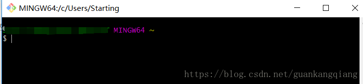

尝试输入一写git 的命令，发现说没有库，因为我的路劲是在桌面上现在

当然你也可以输入 git --help命令查看有什么命令（我是看不太懂= =）

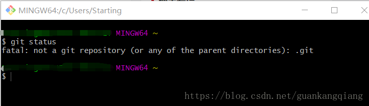


2、设置你的信息，就是你想上传到github的时候会同时记录到上面去，显示是谁提交的

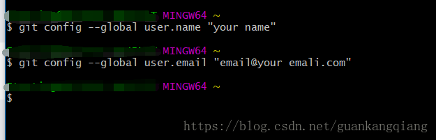


3、创建你的库，你可以理解为一个放置你所有程序的仓库

我是在我的G盘中创建一个CSDN的库，你也可以在电脑上直接创建，**记得你创建的绝对路径**，然后进入

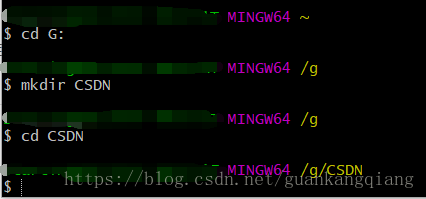


4、初始化你的版本库（本地库）,在你的库中出现了一个.git的文件夹，这个文件夹都是git的配置文件，别动

命令：  $ git init

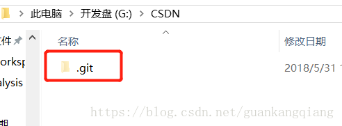


5、给这个库添加一个文件，可以百度vim的命令 <https://www.cnblogs.com/usergaojie/p/4583796.html>

命令  :  $ vim readme.txt

进入编辑模式，写入，!wq保存并退出

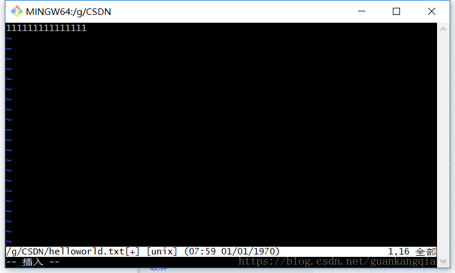


6、将文件保存到（Stage）暂存区，可以理解为本地库和远程库中间过度的东西。

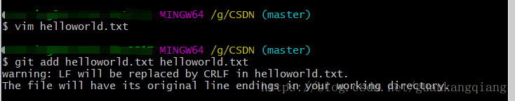


7、提交到远程库

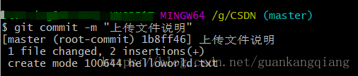


#### 三、让git和github关联起来

两者是通过ssh连接的，安全又快速

1、在这里查找你的公钥和密钥    C:\Users\你的用户名\.ssh

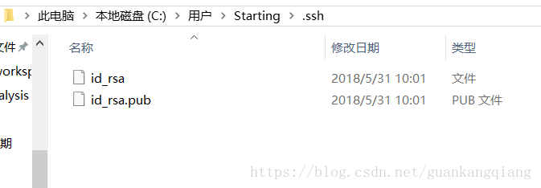


2、d_rsa是你的私有密钥，id_rsa.pub是公钥，打开文本复制里面的内容，复制到你的github账户setting的ssh

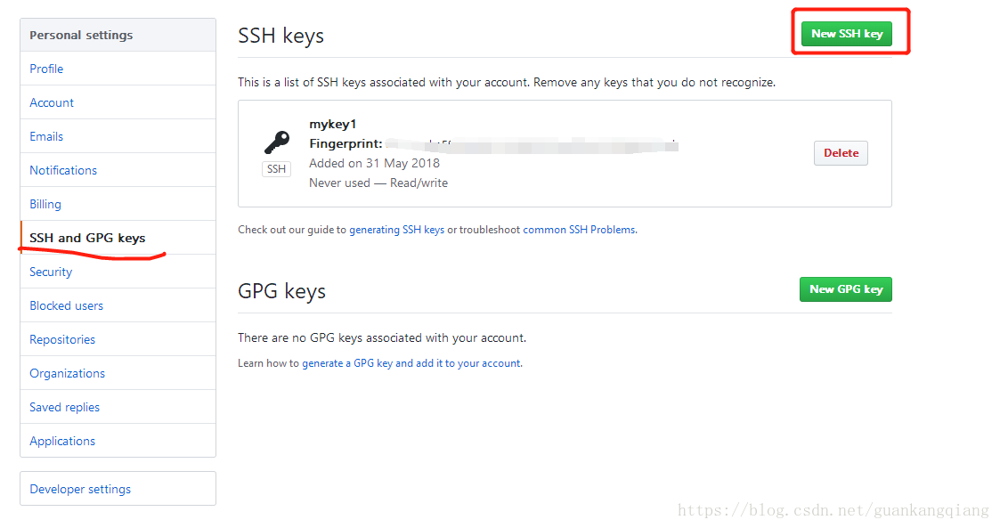


3、测试ssh  key是否成功，使用命令“ssh -T git@github.com”，如果出现You’ve successfully  authenticated, but GitHub does not provide shell access  。这就表示已成功连上github。

不成功？看这个<https://jingyan.baidu.com/article/ca00d56c4861b0e99febcf6e.html>


四、将本地库的内容推到远程库

1、在github上面创造一个你的库,public是免费的，private是收费的

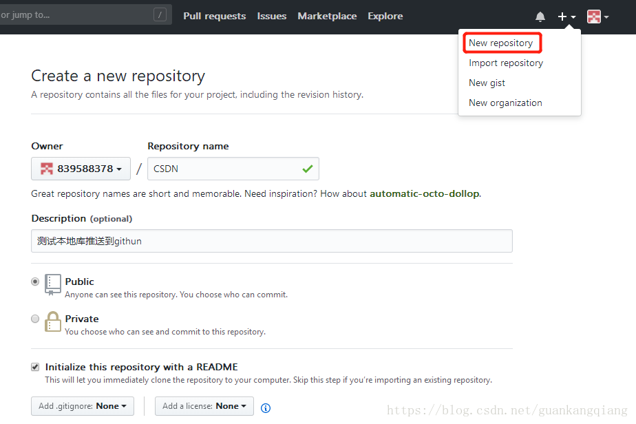


2、创建成功后就是这种结果

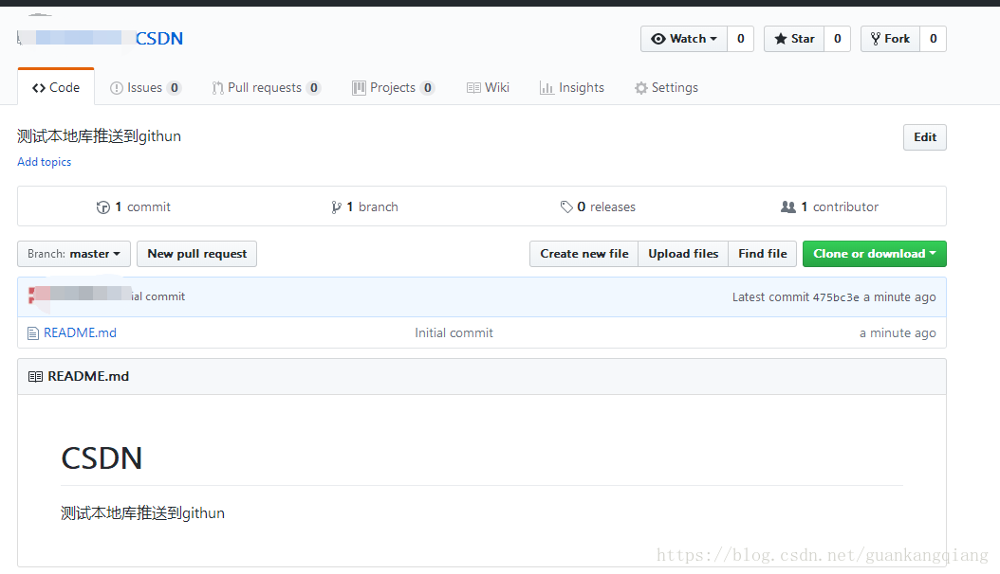


3、复制github库上的地址

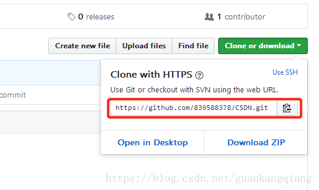


4、有两种方式，一种是直接复制远程库到本地库，另外一种是本地直接连接远程库

1）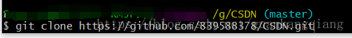

2)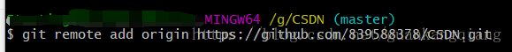

**注意：这里要输入你自己的远程库的ssh**


**5、推送上去**

**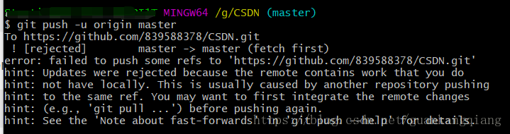**

出现这个错误是因为本地commit一个提交和远端服务器中的代码有冲突

是设置远程库的时候默认生成了一个README.md的文件

$git pull –rebase origin master


6、上传到远程库

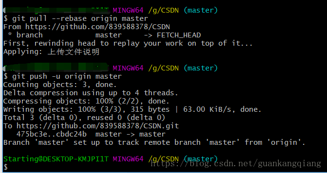


7、去到GitHub上绵看下你的文件，多了helloworld.txt,完成

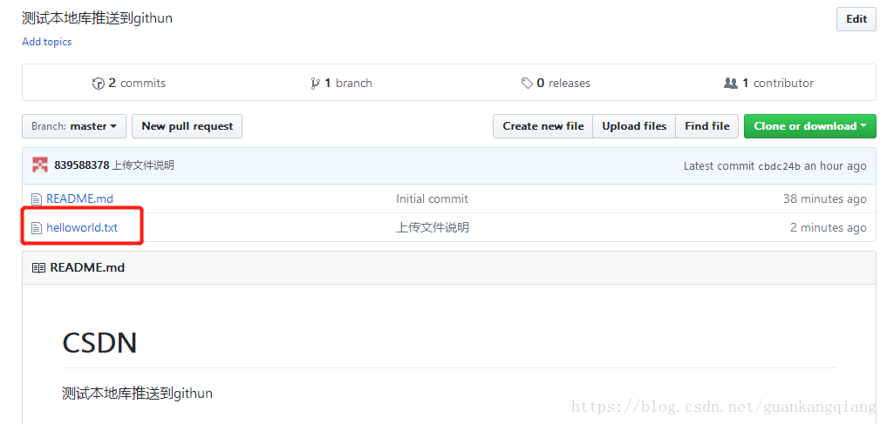