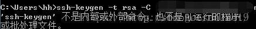
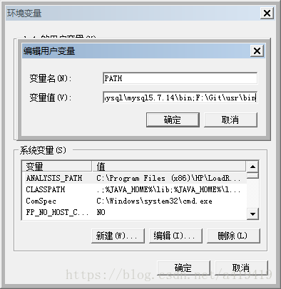
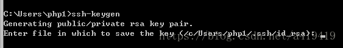
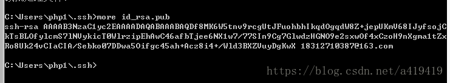
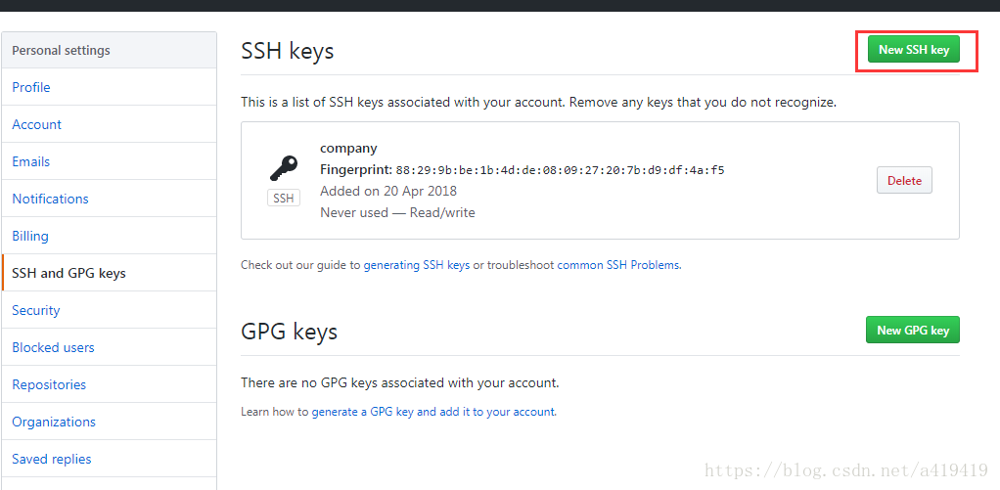

# windows下ssh-keygen 不是内部或外部命令和打开id_rsa.pub文件

​                              

 
 ssh-keygen 不是内部或外部命令，主要是没有找到ssh-keygen.exe，所以我们要将ssh-keygen.exe文件所在的目录配置到全局变量中去。 
 1.找到Git/usr/bin目录下的ssh-keygen.exe 
 2.属性–>高级系统设置–>环境变量–>系统变量,找到Path变量，进行编辑，End到最后，输入分号，粘贴复制的ssh-keygen所在的路径，保存； 
  
 然后在运行： 
 

成功运行了

```
ssh-keygen -t rsa -C "你的github帐号所对应的邮箱"1
```

之后怎样打开id_rsa.pub文件获取里面的密钥呢！ 
 进入ssh文件夹，然后输入：

```
more id_rsa.pub1
```

 

文件路径貌似 C:\Users\Administrator 下直接有的

网上乱说的 `cat id_rsa.pub` 
 根本不是windows下的，所以会报cat 不是内部或外部命令这个错误。 
 获得了密钥之后，打开你的github帐号中的setting，点击如下图的按钮进行添加，便可以了！ 
 