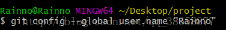
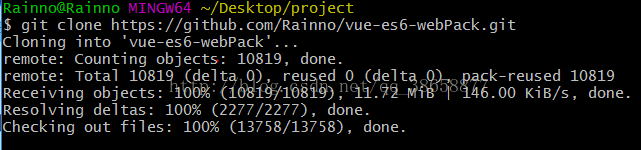
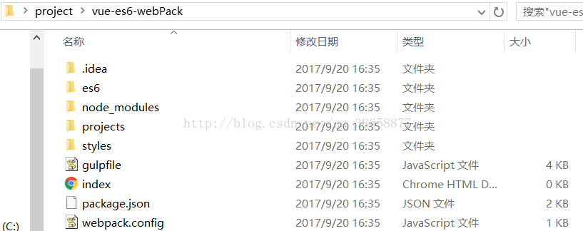

# 利用git从github上拉取项目

## （一）准备工作

（1）安装git,下载地址是git官网：https://git-scm.com/[点击打开链接](http://git-scm.com/)

## （二）拉取项目的步骤

1、新建文件夹，最好为英文名project

2、进入文件夹，空白处右键，选择gitbash here,键入git init会生成.git文件（如果没有，或许被隐藏了，无关紧要）

3、配置本地仓库的账号邮箱git

$ git config --global user.name "Your Name"

$ git config --global user.email "email@example.com"

 

4、为了避免每次远程访问需要输密码，将使用ssh登陆。ssh应该与本机信息绑定。查看自己电脑C:\Users\Administrator 目录下是否有 .ssh 文件夹。如果没有就需要生成。

$ ssh-keygen -t rsa -C "youremail@example.com"

5、ssh只是本地详细，需要在Github中备份，才能被验证。打开自己的Github，在MyProfile中，点击Add Public Key，title随意。

6、key中的内容在本机C盘中，C:\Users\Administrator，里面有个.ssh文件夹，用文本文档打开id_rsa.pub ，将里面的内容全部复制到key中，即可

 

7、获取github上的项目，需找到项目地址

$ git clone 项目地址 （此处的项目地址：https://github.com/Rainno/vue-es6-webPack.git[点击打开链接](https://github.com/Rainno/vue-es6-webPack.git)）

拉取项目成功

转载。 https://blog.csdn.net/qq_38658877/article/details/78042508