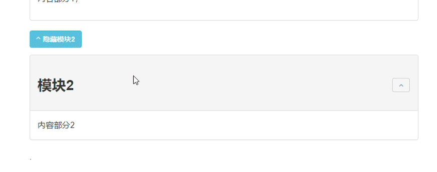
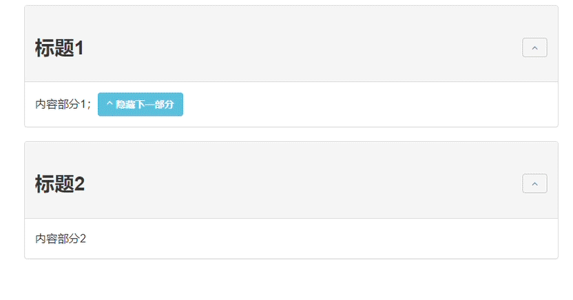
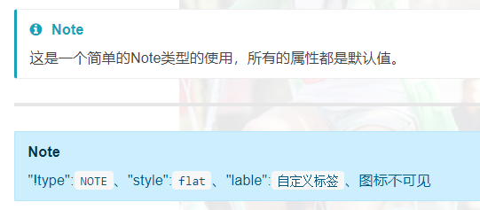

# GitBook插件整理

 介绍一下gitbook中`book.json`的一些实用配置和插件

# 1. 配置概况

## 1.1. 全局配置

1. title
    设置书本的标题
    `"title" : "Gitbook Use"` 
2. author
    作者的相关信息
    `"author" : "mingyue"` 
3. description
    本书的简单描述
    `"description" : "记录Gitbook的配置和一些插件的使用"` 
4. language
    Gitbook使用的语言, 版本2.6.4中可选的语言如下：
    `en, ar, bn, cs, de, en, es, fa, fi, fr, he, it, ja, ko, no, pl, pt, ro, ru, sv, uk, vi, zh-hans, zh-tw`
    例如，配置使用简体中文
    `"language" : "zh-hans"` 
5. links
    在左侧导航栏添加链接信息

```
"links" : {
    "sidebar" : {
        "Home" : "https://www.baidu.com"
    }
}
```

1. styles
    自定义页面样式， 默认情况下各generator对应的css文件

```
"styles": {
    "website": "styles/website.css",
    "ebook": "styles/ebook.css",
    "pdf": "styles/pdf.css",
    "mobi": "styles/mobi.css",
    "epub": "styles/epub.css"
}
```

例如使`<h1> <h2>`标签有下边框， 可以在`website.css`中设置

```
h1 , h2{
    border-bottom: 1px solid #EFEAEA;
}
```

## 1.2. 插件列表 plugins

配置使用的插件

```
"plugins": [
    "-search",
    "back-to-top-button",
    "expandable-chapters-small",
    "insert-logo"
]
```

其中`"-search"`中的 `-` 符号代表去除默认自带的插件
 Gitbook默认自带有5个插件：

- highlight： 代码高亮
- search： 导航栏查询功能（不支持中文）
- sharing：右上角分享功能
- font-settings：字体设置（最上方的"A"符号）
- livereload：为GitBook实时重新加载

## 1.3. 插件属性配置pluginsConfig

配置插件的属性
 例如配置`insert-logo`的属性：

```
  "pluginsConfig": {
    "insert-logo": {
      "url": "images/logo.png",
      "style": "background: none; max-height: 30px; min-height: 30px"
    }
  }
```

# 2. 一些实用插件

记录一些实用的插件
 用法：在book.json中添加`"plugins"`和`"pluginConfig"`字段。然后执行`gitbook install`，或者使用NPM安装`npm install gitbook-plugin-插件名`，也可以从源码GitHub地址中下载，放到`node_modules`文件夹里（GitHub地址在进入插件地址右侧的GitHub链接）

## 2.1. back-to-top-button  回到顶部

[插件地址](https://plugins.gitbook.com/plugin/back-to-top-button)
 [GitHub地址](https://github.com/stuebersystems/gitbook-plugin-back-to-top-button)
 在book.json中添加以下内容。然后执行`gitbook install`，或者使用NPM安装`npm install gitbook-plugin-back-to-top-button`，也可以从源码GitHub地址中下载，放到`node_modules`文件夹里（GitHub地址在进入插件地址右侧的GitHub链接）

```
{
    "plugins": [
         "back-to-top-button"
    ]
}
```

## 2.2. 导航目录扩展

### 2.2.1. chapter-fold 导航目录折叠

支持多层目录，点击导航栏的标题名就可以实现折叠扩展。
 [插件地址](https://plugins.gitbook.com/plugin/chapter-fold)
 [GitHub地址](https://github.com/ColinCollins/gitbook-plugin-chapter-fold)
 在book.json中添加以下内容。然后执行`gitbook install`，或者使用NPM安装`npm install gitbook-plugin-chapter-fold`，也可以从源码GitHub地址中下载，放到`node_modules`文件夹里（GitHub地址在进入插件地址右侧的GitHub链接）

```
{
    "plugins": ["chapter-fold"]
}
```

### 2.2.2. expandable-chapters-small  可扩展导航章节

支持多层目录，比[Toggle Chapters](https://plugins.gitbook.com/plugin/toggle-chapters)好用
 点击箭头才能实现收放目录。不如【2.2.1. chapter-fold 左侧目录折叠】好用
 [插件地址](https://plugins.gitbook.com/plugin/expandable-chapters-small)
 [GitHub地址](https://github.com/chrisjake/gitbook-plugin-expandable-chapters-small)
 在book.json中添加以下内容。然后执行`gitbook install`，或者使用NPM安装`npm install gitbook-plugin-expandable-chapters-small`，也可以从源码GitHub地址中下载，放到`node_modules`文件夹里（GitHub地址在进入插件地址右侧的GitHub链接）

```
{
    "plugins": [
         "expandable-chapters-small"
    ]
}
```

### 2.2.3. expandable-chapters 可扩展导航章节

和expandable-chapters-small效果相同，唯一不同的是这个插件的箭头粗
 [插件地址](https://plugins.gitbook.com/plugin/expandable-chapters)
 [GitHub地址](https://github.com/DomainDrivenArchitecture/gitbook-plugin-expandable-chapters)
 在book.json中添加以下内容。然后执行`gitbook install`，或者使用NPM安装`npm install gitbook-plugin-expandable-chapters`，也可以从源码GitHub地址中下载，放到`node_modules`文件夹里（GitHub地址在进入插件地址右侧的GitHub链接）

```
{
    "plugins": [
         "expandable-chapters"
    ]
}
```

## 2.3. 代码复制，行号

### 2.3.1. code 代码添加行号&复制按钮（可选）

为代码块添加行号和复制按钮，复制按钮可关闭
 单行代码无行号。
 [插件地址](https://plugins.gitbook.com/plugin/code-postman)
 [GitHub地址](https://github.com/TGhoul/gitbook-plugin-code)
 在book.json中添加以下内容。然后执行`gitbook install`，或者使用NPM安装`npm install gitbook-plugin-code`，也可以从源码GitHub地址中下载，放到`node_modules`文件夹里（GitHub地址在进入插件地址右侧的GitHub链接）

```
{
    "plugins" : [ "code" ]
}
```

如果想去掉复制按钮，在book.json的插件配置块更新：

```
{
    "plugins" : [ 
            "code" 
     ],
    "pluginsConfig": {
      "code": {
        "copyButtons": false
      }
    }
}
```

### 2.3.2. copy-code-button 代码复制按钮

为代码块添加复制的按钮。
 [插件地址](https://plugins.gitbook.com/plugin/copy-code-button)
 [GitHub地址](https://github.com/WebEngage/gitbook-plugin-copy-code-button)
 在book.json中添加以下内容。然后执行`gitbook install`，或者使用NPM安装`npm install gitbook-plugin-copy-code-button`，也可以从源码GitHub地址中下载，放到`node_modules`文件夹里（GitHub地址在进入插件地址右侧的GitHub链接）

```
{
    "plugins": ["copy-code-button"]
}
```

效果如下图所示：


## 2.4. todo  待做项☑

添加 Todo 功能。默认的 checkbox 会向右偏移 2em，如果不希望偏移，可以在 `website.css` 里加上下面的代码:

```
input[type=checkbox]{
    margin-left: -2em;
}
```

[插件地址](https://plugins.gitbook.com/plugin/todo)
 [GitHub地址](https://github.com/ly-tools/gitbook-plugin-todo)
 在book.json中添加以下内容。然后执行`gitbook install`，或者使用NPM安装`npm install gitbook-plugin-todo`，也可以从源码GitHub地址中下载，放到`node_modules`文件夹里（GitHub地址在进入插件地址右侧的GitHub链接）

```
{
    "plugins": ["todo"]
}
```

使用示例：

```
*   [ ]  write some articles
*   [x]  drink a cup of tea
```

## 2.5. insert-logo  插入logo

将logo插入到导航栏上方中
 [插件地址](https://plugins.gitbook.com/plugin/insert-logo)
 [GitHub地址](https://github.com/matusnovak/gitbook-plugin-insert-logo)
 在book.json中添加以下内容。然后执行`gitbook install`，或者使用NPM安装`npm install gitbook-plugin-insert-logo`，也可以从源码GitHub地址中下载，放到`node_modules`文件夹里（GitHub地址在进入插件地址右侧的GitHub链接）

```
{
    "plugins": [ "insert-logo" ]
    "pluginsConfig": {
      "insert-logo": {
        "url": "images/logo.png",
        "style": "background: none; max-height: 30px; min-height: 30px"
      }
    }
}
```

## 2.6. search-pro  高级搜索（支持中文）

支持中文搜索, 在使用此插件之前，需要将默认的`search`和`lunr` 插件去掉。
 [插件地址](https://plugins.gitbook.com/plugin/search-pro)
 [GitHub地址](https://github.com/gitbook-plugins/gitbook-plugin-search-pro)
 在book.json中添加以下内容。然后执行`gitbook install`，或者使用NPM安装`npm install gitbook-plugin-search-pro`

```
{
    "plugins": [
          "-lunr", 
          "-search", 
          "search-pro"
    ]
}
```

## 2.7. advanced-emoji - 支持emoji表情

[emoij表情列表](http://www.emoji-cheat-sheet.com/)
 [插件地址](https://plugins.gitbook.com/plugin/advanced-emoji)
 [GitHub地址](https://github.com/codeclou/gitbook-plugin-advanced-emoji)
 在book.json中添加以下内容。然后执行`gitbook install`，或者使用NPM安装`npm install gitbook-plugin-advanced-emoji`，也可以从源码GitHub地址中下载，放到`node_modules`文件夹里（GitHub地址在进入插件地址右侧的GitHub链接）

```
{
    "plugins": [
        "advanced-emoji"
    ]
}
```

## 2.8. github 在右上角添加github图标

[插件地址](https://plugins.gitbook.com/plugin/github)
 [GitHub地址](https://github.com/GitbookIO/plugin-github)
 在book.json中添加以下内容。然后执行`gitbook install`，或者使用NPM安装`npm install gitbook-plugin-github`，也可以从源码GitHub地址中下载，放到`node_modules`文件夹里（GitHub地址在进入插件地址右侧的GitHub链接）

```
{
    "plugins": [ 
        "github" 
    ],
    "pluginsConfig": {
        "github": {
            "url": "https://github.com/zhangjikai"
        }
    }
}
```


 效果图：


## 2.9. emphasize 为文字加上底色

[插件地址](https://plugins.gitbook.com/plugin/emphasize)
 [GitHub地址](https://github.com/GitbookIO/plugin-emphasize)
 在book.json中添加以下内容。然后执行`gitbook install`，或者使用NPM安装`npm install gitbook-plugin-emphasize`，也可以从源码GitHub地址中下载，放到`node_modules`文件夹里（GitHub地址在进入插件地址右侧的GitHub链接）

```
{
    "plugins": [
        "emphasize"
    ]
}
```

然后在markdown / asciidoc内容中，使用以下内容突出显示一些文本：

```
  This text is highlighted !
  This text is highlighted with **markdown**!
  This text is highlighted in green!
  This text is highlighted in red!
  This text is highlighted with a custom color!
```


 效果图：


## 2.10. splitter 侧边栏宽度可调节

[插件地址](https://plugins.gitbook.com/plugin/splitter)
 [GitHub地址](https://github.com/yoshidax/gitbook-plugin-splitter)
 在book.json中添加以下内容。然后执行`gitbook install`，或者使用NPM安装`npm install gitbook-plugin-splitter`，也可以从源码GitHub地址中下载，放到`node_modules`文件夹里（GitHub地址在进入插件地址右侧的GitHub链接）

```
{
    "plugins": [
        "splitter"
    ]
}
```


 效果图：


## 2.11. sharing-plus

分享当前页面，比默认的 sharing 插件多了一些分享方式。
 [插件地址](https://plugins.gitbook.com/plugin/sharing-plus)
 在book.json中添加以下内容。然后执行`gitbook install`，或者使用NPM安装`npm install gitbook-plugin-sharing-plus`

```
{
    "plugins": ["-sharing", "sharing-plus"],
    "pluginsConfig": {
        "sharing": {
             "douban": false,
             "facebook": false,
             "google": true,
             "pocket": false,
             "qq": false,
             "qzone": true,
             "twitter": false,
             "weibo": true,
          "all": [
               "douban", "facebook", "google", "instapaper", "linkedin","twitter", "weibo", 
               "messenger","qq", "qzone","viber","whatsapp"
           ]
       }
    }
}
```

其中：
 为true的代表直接显示在页面顶端，为false的不显示，不写默认为false
 "all"中代表点击分享符号显示出来的
 支持网站：

```
  "douban", "facebook", "google", "hatenaBookmark", 
  "instapaper", "linkedin","twitter", "weibo", 
  "messenger","qq", "qzone","viber","vk","weibo",
  "pocket", "stumbleupon","whatsapp"
```

效果图：


 如果想增加其他分享网站，可以自己修改插件文件

```
button.js
```

和

```
package.json
```

。


- 首先你要知道那个网站的分享链接的结构（可以随便找其他的网站点击分享看看URL），比如我增加分享到人人网,链接是这样的结构（红框里的是通用结构，后面内容是不同的。第一部分表示被分享的URL，第二部分是标题title）：

  

  

- 然后在`button.js`中的`var SITES = {····}`中添加一条信息，和上面其他分享的信息类似。比如我增加的人人网是这样的

  

  

- 在`package.json`中仿照前面内容添加新网站的信息。比如我添加的人人网：

```
      "renren": {
        "default": false,
        "description": "人人网",
        "type": "boolean"
      }
```

## 2.12. 页面添加页脚、版权信息

### 2.12.1. tbfed-pagefooter 页面添加页脚（简单的）

添加页脚，版权信息
 [插件地址](https://plugins.gitbook.com/plugin/tbfed-pagefooter)
 [GitHub地址](https://github.com/zhj3618/gitbook-plugin-tbfed-pagefooter)
 在book.json中添加以下内容。然后执行`gitbook install`，或者使用NPM安装`npm install gitbook-plugin-tbfed-pagefooter`，也可以从源码GitHub地址中下载，放到`node_modules`文件夹里（GitHub地址在进入插件地址右侧的GitHub链接）

```
{
    "plugins": [
       "tbfed-pagefooter"
    ],
    "pluginsConfig": {
        "tbfed-pagefooter": {
            "copyright":"Copyright &copy xxxx.com 2017",
            "modify_label": "该文件修订时间：",
            "modify_format": "YYYY-MM-DD HH:mm:ss"
        }
    }
}
```

如果想加入一个URL，自己可以去index.js里，把`powered by gitbook`，改成
 `powered by <a href="你的URL" target="_blank">你的名字</a>`

### 2.12.2. page-copyright 页面页脚版权（内容多）

[插件地址](https://plugins.gitbook.com/plugin/page-copyright)
 [GitHub地址](https://github.com/skyFi/gitbook-plugin-page-footer)
 在book.json中添加以下内容。然后执行`gitbook install`，或者使用NPM安装`npm install gitbook-plugin-page-copyright`，也可以从源码GitHub地址中下载，放到`node_modules`文件夹里（GitHub地址在进入插件地址右侧的GitHub链接）

```
{
    "plugins" : ["page-copyright"],
    "pluginsConfig" : {
        "page-copyright": {
          "description": "modified at",
          "signature": "你的签名",
          "wisdom": "Designer, Frontend Developer & overall web enthusiast",
          "format": "YYYY-MM-dd hh:mm:ss",
          "copyright": "Copyright &#169; 你的名字",
          "timeColor": "#666",
          "copyrightColor": "#666",
          "utcOffset": "8",
          "style": "normal",
          "noPowered": false,
        }
    }
}
```

运行以后有很多信息是原创作者的，这些配置都在你的插件安装目录`**\node_modules\gitbook-plugin-page-copyright`下的`index.js`中，自己可以修改。大部分信息都在`defaultOption`中。
 那个二维码可以在文件中找到`QRcode`改成自己的，或者直接把所有的`efaultOption.isShowQRCode`改成false

## 2.13. sectionx  将页面分块显示

用于将页面分成多个部分，并添加按钮以允许读者控制每个部分的可见性。
 下面有个更好的折叠模块功能`accordion`
 [插件地址](https://plugins.gitbook.com/plugin/sectionx)
 [GitHub地址](https://github.com/ymcatar/gitbook-plugin-sectionx)
 [示例地址](https://ymcatar.gitbooks.io/gitbook-test/content/testing_sectionx.html)
 在book.json中添加以下内容。然后执行`gitbook install`，或者使用NPM安装`npm install gitbook-plugin-sectionx`，也可以从源码GitHub地址中下载，放到`node_modules`文件夹里（GitHub地址在进入插件地址右侧的GitHub目链接）

```
{
    "plugins": [
           "sectionx"
    ]
}
```

使用方法

1. 内容分块：
    在`.md`文件中定义一个部分（就是插入下面的字段）。
    markdown中示例代码：

```
<!--sec data-title="标题2" data-id="section0" data-show=true ces-->
内容部分2；
<!--endsec-->
```

效果图1：


这里只采用三个参数，其他参数如下所示：

| 参数          | 说明                                                         |
| ------------- | ------------------------------------------------------------ |
| data-title    | 该部分的标题，它将显示为bootstrap面板的标题（大小为h2）。 请注意，您不能使用`"`标题中的字符，请`&quot;`改用。 |
| data-id       | 章节的id，对按钮控制很有用（在下一节中讨论）。               |
| data-show     | 默认表示面板内容是否可见的布尔值。   true：默认情况下，面板内容对用户可见，面板标题可以单击。  false：默认情况下，面板内容对用户隐藏，面板标题不可点击，只能通过添加自定义按钮查看（在下一节中讨论）。 |
| data-nopdf    | 一个布尔值，表示该部分是否将隐藏在pdf导出中。         true：面板不会显示在.pdf或.epub中。 |
| data-collapse | 一个布尔值，表示默认情况下是否打开（但仍然可见）该部分。   true：默认情况下，面板内容对用户可见，但已关闭。         false：默认情况下，面板内容对用户可见，但已打开（默认设置）。 |

1. 添加按钮，控制部分可见性
    通过在GitBook中添加内联HTML，以下代码可以添加一个按钮，以允许您查看或隐藏其他部分。
    简单来说，就是在【使用1】的内容部分添加一个按钮：
    `<button class="section" target="section1" show="显示下一部分" hide="隐藏下一部分"></button>`
    标签说明：

| 标签   | 说明                                                     |
| ------ | -------------------------------------------------------- |
| class  | 该按钮必须属于类“section”。//这里就是用到 1部分的section |
| target | 当按下时，将切换id为target的部分。                       |
| show   | 隐藏目标部分时按钮上的文本。                             |
| hide   | 目标部分可见时按钮上的文本。                             |

markdown中示例代码：

```
<button class="section" target="section2" show="显示模块2" hide="隐藏模块2"></button>
<!--sec data-title="模块2" data-id="section2" data-show=true ces-->
内容部分2
<!--endsec-->
```

效果图2：




1. 混合使用
    将第2节的button块添加到第1节的内容部分
    markdown中示例代码：

```
<!--sec data-title="标题1" data-id="section0" data-show=true ces-->
内容部分1；
<button class="section" target="section1" show="显示下一部分" hide="隐藏下一部分"></button>
<!--endsec-->
<!--sec data-title="标题2" data-id="section1" data-show=true ces-->
内容部分2
<!--endsec-->
```

效果图3：




## 2.14. 生成页内目录

### 2.14.1. page-treeview 生成页内目录

不需要插入标签，能支持到6级目录，安装可用
 [插件地址](https://plugins.gitbook.com/plugin/page-treeview)
 [GitHub地址](https://github.com/aleen42/gitbook-treeview)
 在book.json中添加以下内容。然后执行`gitbook install`，或者使用NPM安装`npm install gitbook-plugin-page-treeview`，也可以从源码GitHub地址中下载，放到`node_modules`文件夹里（GitHub地址在进入插件地址右侧的GitHub链接）

```
{
    "plugins": ["page-treeview"]
}
```

非必要的配置项：

```
{
    "plugins": [
        "page-treeview"
    ],
    "pluginsConfig": {
        "page-treeview": {
            "copyright": "Copyright &#169; aleen42",
            "minHeaderCount": "2",
            "minHeaderDeep": "2"
        }
    }
}
```

偷偷地告诉你，这个插件生成目录以后，下面有一行关于版权的文字。如果想去掉的话，找到插件目录下的`index.js`文件：`***/node_modules/gitbook-plugin-page-treeview/lib/index.js`
 找到大约111行，删除这一行关于`var copyRight`的定义
 下面113行的`var insertTreeview`中，删除`+ copyRight`，目前就不显示了
 142行中的`'copyright': 'Copyright &#169; aleen42',`也可以删除
 下面161行和163行和111行113行一样的，其实不删除也不显示了。
 这个应该不算侵权吧。如果是的话，请联系我。。

### 2.14.2. simple-page-toc  生成本页目录

需要在文章中插入标签，支持1-3级目录
 页面顶端生成。另外 GitBook 在处理重复的标题时有些问题，所以尽量不适用重复的标题。
 [插件地址](https://plugins.gitbook.com/plugin/simple-page-toc)
 [GitHub地址](https://github.com/stuebersystems/gitbook-plugin-simple-page-toc)
 在book.json中添加以下内容。然后执行`gitbook install`，或者使用NPM安装`npm install gitbook-plugin-simple-page-toc`，也可以从源码GitHub地址中下载，放到`node_modules`文件夹里（GitHub地址在进入插件地址右侧的GitHub链接）（"pluginsConfig"不是必需的）

```
{
    "plugins" : [
        "simple-page-toc"
    ],
    "pluginsConfig": {
        "simple-page-toc": {
            "maxDepth": 3,
            "skipFirstH1": true
        }
    }
}
```

| 参数                | 说明                           |
| ------------------- | ------------------------------ |
| "maxDepth": 3       | 使用深度最多为maxdepth的标题。 |
| "skipFirstH1": true | 排除文件中的第一个h1级标题。   |

使用方法: 在需要生成目录的地方用下面的标签括起来，全文都生成的话就在首尾添加

```
<!-- toc -->内容部分<!-- endtoc -->
```

## 2.15. 悬浮目录

### 2.15.1. page-toc-button 悬浮目录

[插件地址](https://plugins.gitbook.com/plugin/page-toc-button-rmp)
 在book.json中添加以下内容。然后执行`gitbook install`，或者使用NPM安装（`npm install gitbook-plugin-ancre-navigation`，也可以从源码GitHub地址中下载，放到`node_modules`文件夹里

```
{
    "plugins" : [ "page-toc-button" ]
}
```

可选配置：

```
{
    "plugins" : [ 
        "page-toc-button" 
    ],
    "pluginsConfig": {
        "page-toc-button": {
            "maxTocDepth": 2,
            "minTocSize": 2
           }
    }
}
```

| 名称        | 默认 | 描述                                              |
| ----------- | ---- | ------------------------------------------------- |
| maxTocDepth | 2    | 标题的最大深度（2 = h1 + h2 + h3）。不支持值> 2。 |
| minTocSize  | 2    | 显示toc按钮的最小toc条目数。                      |

## 2.15.2. ancre-navigation  悬浮目录和回到顶部

添加Toc到侧边悬浮导航以及回到顶部按钮。
 自动在标题前生成列表项："1.  " "1.1. "  "2. " "2.2. "
 需要注意以下两点：

- 本插件只会提取 h[1-3] 标签作为悬浮导航

- 只有按照以下顺序嵌套才会被提取 

  ```
  # h1
  ## h2
  ### h3
  必须要以 h1 开始，直接写 h2 不会被提取
  ## h2
  ```

[插件地址](https://plugins.gitbook.com/plugin/ancre-navigation)
 [GitHub地址](https://www.jianshu.com/p/427b8bb066e6)
 [类似插件](https://plugins.gitbook.com/plugin/anchor-navigation-ex)
 在book.json中添加以下内容。然后执行`gitbook install`，或者使用NPM安装`npm install gitbook-plugin-ancre-navigation`，也可以从源码GitHub地址中下载，放到`node_modules`文件夹里（GitHub地址在进入插件地址右侧的GitHub链接）

```
{
    "plugins": [
        "ancre-navigation"
    ]
}
```

## 2.16. klipse 嵌入类似IDE的功能

嵌入一块功能，可在代码段中实时交互，即（输入代码 > 执行结果
 [插件地址](https://plugins.gitbook.com/plugin/klipse)
 [GitHub地址](https://github.com/brian-dawn/gitbook-plugin-klipse)
 [Klipse](https://github.com/viebel/klipse)
 在book.json中添加以下内容。然后执行`gitbook install`，或者使用NPM安装`npm install gitbook-plugin-klipse`，也可以从源码GitHub地址中下载，放到`node_modules`文件夹里（GitHub地址在进入插件地址右侧的GitHub链接）

```
{
    "plugins": ["klipse"]
}
```

klipse 目前支持下面的语言：

- javascript: evaluation is done with the javascript function eval and pretty printing of the result is done with pretty-format
- clojure[script]: evaluation is done with Self-Hosted Clojurescript
- ruby: evaluation is done with Opal
- C++: evaluation is done with JSCPP
- python: evaluation is done with Skulpt
- scheme: evaluation is done with BiwasScheme
- PHP: evaluation is done with Uniter
- BrainFuck
- JSX
- EcmaScript2017
- Google Charts: See Interactive Business Report with Google Charts.

下面是一个python的使用示例，其他语言类似，比如（eval-js）：

```
​```eval-python
print [x + 1 for x in range(10)]
​```
```

效果如下所示：


## 2.17. donate  打赏插件

文章最下面的按钮，点击可弹出图片
 [插件地址](https://plugins.gitbook.com/plugin/donate)
 [GitHub地址](https://github.com/willin/gitbook-plugin-donate)
 在book.json中添加以下内容。然后执行`gitbook install`，或者使用NPM安装`npm install gitbook-plugin-donate`，也可以从源码GitHub地址中下载，放到`node_modules`文件夹里（GitHub地址在进入插件地址右侧的GitHub链接）

```
{
    "plugins": [
        "donate"
    ],
    "pluginsConfig": {
        "donate": {
            "wechat": "微信收款的二维码URL",
            "alipay": "支付宝收款的二维码URL",
            "title": "",
            "button": "赏",
            "alipayText": "支付宝打赏",
            "wechatText": "微信打赏"
        }
    }
}
```

## 2.18. change_girls  可自动切换的背景

添加背景图片，并且可以自动切换
 [插件地址](https://github.com/zhenchao125/gitbook-plugin-change_girls)
 [GitHub地址](https://github.com/zhenchao125/gitbook-plugin-change_girls)
 在book.json中添加以下内容。然后执行`gitbook install`，或者使用NPM安装`npm install gitbook-plugin-change_girls`，也可以从源码GitHub地址中下载，放到`node_modules`文件夹里（GitHub地址在进入插件地址右侧的GitHub链接是）

```
{
    "plugins":["change_girls"],
    "pluginsConfig": {
        "change_girls" : {
            "time" : 10,
            "urls" : [
                "girlUrl1", "girlUrl2",...""
            ]
        }
    }
}
```

字段说明：

- time：图片的切换时间，单位是秒
- urls： 一个数组，可以定义多个图片，只能使用互联网上的绝对地址

## 2.19. 警报

这两个警报插件类似，其中的图标文件有些可以共用

### 2.19.1. alerts 警报

这个GitBook插件将块引用转换为漂亮的警报。
 [插件地址](https://plugins.gitbook.com/plugin/alerts)
 在book.json中添加以下内容。然后执行`gitbook install`，或者使用NPM安装`npm install gitbook-plugin-flexible-alerts`

```
{
    "plugins": ["alerts"]
}
```

用法样式：
 信息样式

```
> **[info] For info**
>
> Use this for infomation messages.
```

警告造型

```
> **[warning] For warning**
>
> Use this for warning messages.
```

危险造型

```
> **[danger] For danger**
>
> Use this for danger messages.
```

成功造型

```
> **[success] For success**
>
> Use this for success messages.
```

### 2.19. flexible-alerts  警报

这个GitBook插件将块引用转换为漂亮的警报。可以在全局和警报特定级别配置外观，因此输出确实符合您的需求（如下图）。此外，您还可以提供自己的警报类型（比如最后的comment）。


图 19

[插件地址](https://plugins.gitbook.com/plugin/flexible-alerts)
 [GitHub地址](https://github.com/zanfab/gitbook-plugin-flexible-alerts)
 这个看上面那个链接里的内容更丰富一点

> 1. 在你的gitbook的book.json文件中，添加flexible-alerts到插件列表。
> 2. 在pluginsConfig中，配置插件以满足您的需求。自定义设置不是必需的。

**简单使用**

1. 在book.json中添加以下内容。然后执行`gitbook install`，或者使用NPM安装`npm install gitbook-plugin-flexible-alerts`，也可以从源码GitHub地址中下载，放到`node_modules`文件夹里（GitHub地址在进入插件地址右侧的GitHub链接）

```
{
  "plugins": [
      "flexible-alerts"
  ]
}
```

1. markdown文件中编辑
    简单的markdown文件写法，效果见上图 19 的第一个图：

```
> [!NOTE]
> 这是一个简单的Note类型的使用，所有的属性都是默认值。
```

上面的`[!NOTE]`是行匹配模式，默认情况下支持类型`NOTE`，`TIP`，`WARNING`和`DANGER`。
 可以通过提供有效配置来扩展可用类型（请参阅这一节最下面的示例COMMENT）

------

个性化使用：
 **在markdown中的个性化语法**

```
> [!type|style:xx|label:xx|icon:xx|className:xx|labelVisibility:xx|iconVisibility:xx]
> 内容部分
```

字段介绍，如果不设置的表示选择默认，除了`!type`都不是必需

|       键        | 允许的值                                | 说明                                               |
| :-------------: | --------------------------------------- | -------------------------------------------------- |
|      !type      | `NOTE`，`TIP`，`WARNING`和`DANGER`      | 警告级别设置                                       |
|      style      | 以下值之一:  `callout`（默认）, `flat`  | 警告样式，见图19的左右不同                         |
|      label      | 任何文字                                | 警告块的标题位置，即Note这个字段位置（不支持中文） |
|      icon       | e.g. 'fa fa-info-circle'                | 一个有效的Font Awesome图标，那块小符号             |
|    className    | CSS类的名称                             | 指定css文件，用于指定外观                          |
| labelVisibility | 以下值之一：`visible`（默认），`hidden` | 标签是否可见                                       |
| iconVisibility  | 以下值之一：`visible`（默认），`hidden` | 图标是否可见                                       |

对比：

```
> [!NOTE]
> 这是一个简单的Note类型的使用，所有的属性都是默认值。

---

> [!NOTE|style:flat|lable:Mylable|iconVisibility:hidden]
> "!type":`NOTE`、"style":`flat`、"lable":`自定义标签`、图标不可见
```

效果：




------

**json配置个性化**
 自定义一个COMMENT类型
 在book.json中添加以下内容。然后执行`gitbook install`，或者使用NPM安装`npm install gitbook-plugin-flexible-alerts`，也可以从源码GitHub地址中下载，放到`node_modules`文件夹里（GitHub地址在进入插件地址右侧的GitHub链接）

```
{
    "plugins": [
      "flexible-alerts"
    ],
    "pluginsConfig": {
      "flexible-alerts": {
        "style": "callout",
        "comment": {
          "label": "Comment",
          "icon": "fa fa-comments",
          "className": "info"
        }
      }
    }
}
```

示例：

```
> [!COMMENT]
> An alert of type 'comment' using style 'callout' with default settings.
```

效果：


## 2.20. pageview-count  阅读量计数

[插件地址](https://plugins.gitbook.com/plugin/pageview-count)
 [GitHub地址](https://www.jianshu.com/p/427b8bb066e6)
 在book.json中添加以下内容。然后执行`gitbook install`，或者使用NPM安装`npm install gitbook-plugin-pageview-count`，也可以从源码GitHub地址中下载，放到`node_modules`文件夹里（GitHub地址在进入插件地址右侧的GitHub链接）

```
{
  "plugins": [ "pageview-count"]
}
```

## 2.21. auto-scroll-table 表格滚动条

为避免表格过宽，增加滚动条
 [插件地址](https://plugins.gitbook.com/plugin/auto-scroll-table)
 [GitHub地址](https://www.jianshu.com/p/427b8bb066e6)
 在book.json中添加以下内容。然后执行`gitbook install`，或者使用NPM安装`npm install gitbook-plugin-pageview-count`，也可以从源码GitHub地址中下载，放到`node_modules`文件夹里（GitHub地址在进入插件地址右侧的GitHub链接）

```
{
  "plugins": ["auto-scroll-table"]
}
```

无滚动条刷新一下，不够宽也是没有滚动条的

## 2.22. 查看图片

### 2.22.1.  popup 弹出大图

单击图片，在新页面查看大图。
 [插件地址](https://plugins.gitbook.com/plugin/popup)
 [GitHub地址](https://github.com/somax/gitbook-plugin-popup)
 在book.json中添加以下内容。然后执行`gitbook install`，或者使用NPM安装`npm install gitbook-plugin-lightbox`，也可以从源码GitHub地址中下载，放到`node_modules`文件夹里

```
{
  "plugins": [ "popup" ]
}
```

### 2.22.2. lightbox  单击查看图片

点击图片可显示，大小不变
 [插件地址](https://plugins.gitbook.com/plugin/lightbox)
 [GitHub地址](https://www.jianshu.com/p/427b8bb066e6)
 在book.json中添加以下内容。然后执行`gitbook install`，或者使用NPM安装`npm install gitbook-plugin-lightbox`，也可以从源码GitHub地址中下载，放到`node_modules`文件夹里（GitHub地址在进入插件地址右侧的GitHub链接）

```
{
  "plugins": ["lightbox"]
}
```

## 2.23. click-reveal 点击显示

默认隐藏，点击可显示。
 [插件地址](https://plugins.gitbook.com/plugin/click-reveal)
 [GitHub地址](https://github.com/c4software/gitbook-plugin-click-reveal)
 在book.json中添加以下内容。然后执行`gitbook install`，或者使用NPM安装`npm install gitbook-plugin-click-reveal`，也可以从源码GitHub地址中下载，放到`node_modules`文件夹里（GitHub地址在进入插件地址右侧的GitHub链接）

```
{
    "plugins": [
        "click-reveal"
    ]
}
```

快速使用：
 默认显示的文字是`Click to show`:

```

要被隐藏的内容

```

使用自定义显示文字：

```

要被隐藏的内容

```

用HTML语法也可以：
 `<div class="click_reveal"><span> 点击显示 </span><div><pre><code>隐藏的文字</code></pre></div></div>`

## 2.24. custom-favicon 修改标题栏图标

修改网页标题的图标
 [插件地址](https://plugins.gitbook.com/plugin/custom-favicon)
 [GitHub地址](https://github.com/Bandwidth/gitbook-plugin-custom-favicon)
 在book.json中添加以下内容。然后执行`gitbook install`，或者使用NPM安装`npm install gitbook-plugin-custom-favicon`，也可以从源码GitHub地址中下载，放到`node_modules`文件夹里（GitHub地址在进入插件地址右侧的GitHub链接）

```
{
    "plugins" : ["custom-favicon"],
    "pluginsConfig" : {
        "favicon": "path/to/favicon.ico"
    }
}
```

把`.ico`格式的图标放进项目中。这个路径可以使用相对路径，比如我用的是`./images/a.ico`
 注意：这个pluginsConfig和其他的不大一样。图标只能用`.ico`文件。

## 2.25. accordion 折叠模块

这个插件名叫手风琴，可以实现将内容隐藏起来，外部显示模块标题和显示箭头，点击箭头可显示里面的内容。
 [插件地址](https://plugins.gitbook.com/plugin/accordion)
 [GitHub地址](https://github.com/artalar/gitbook-plugin-accordion)
 [示例](https://artalar.github.io/gitbook-plugin-accordion/)
 在book.json中添加以下内容。然后执行`gitbook install`，或者使用NPM安装`npm install gitbook-plugin-custom-favicon`，也可以从源码GitHub地址中下载，放到`node_modules`文件夹里。

```
{
  "plugins": ["accordion"]
}
```

用法：
 编辑内容，用下面的标签括起来。

```
%accordion%模块标题%accordion%
内容部分
%/accordion%
```

可嵌套，内部可以加代码块，引用，标题等都可以实现。

## 2.26. hide-element 隐藏元素

可以隐藏不想看到的元素，比如导航栏中`Published by GitBook`
 [插件地址](https://plugins.gitbook.com/plugin/hide-element)
 [GitHub地址](https://github.com/gonjay/gitbook-plugin-hide-element)
 在book.json中添加以下内容。然后执行`gitbook install`，或者使用NPM安装`npm install gitbook-plugin-custom-favicon`，也可以从源码GitHub地址中下载，放到`node_modules`文件夹里。

```
{
    "plugins": [
        "hide-element"
    ],
    "pluginsConfig": {
        "hide-element": {
            "elements": [".gitbook-link"]
        }
    }
}
```

